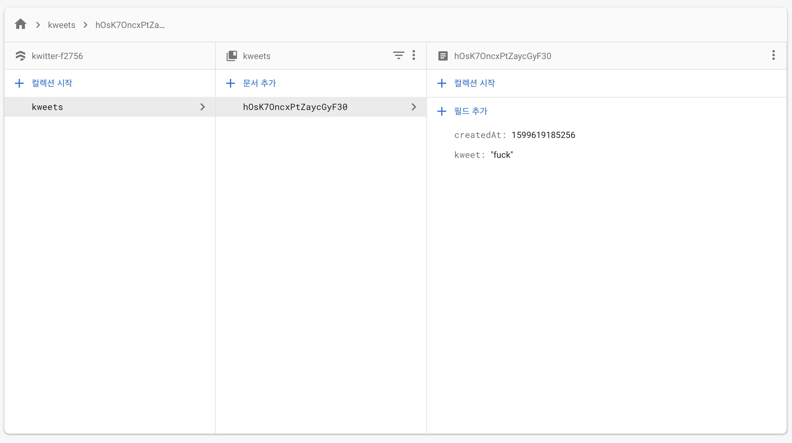

# Firebase from web project

**You must use `await` with all method what return Promise**

## Firebase file from project

```js
import * as firebase from "firebase/app";
import "firebase/auth";
import "firebase/firestore";
import "firebase/storage";

const firebaseConfig = {
  apiKey: process.env.REACT_APP_API_KEY,
  authDomain: process.env.REACT_APP_AUTH_DOMAIN,
  databaseURL: process.env.REACT_APP_DATABASE_URL,
  projectId: process.env.REACT_APP_PROJECT_ID,
  storageBucket: process.env.REACT_APP_STORAGE_BUCKET,
  messagingSenderId: process.env.REACT_APP_MESSAGING_SENDER_ID,
  appId: process.env.REACT_APP_APP_ID,
  measurementId: process.env.REACT_APP_MEASUREMENT_ID,
};

firebase.initializeApp(firebaseConfig);

export const firebaseInstance = firebase;

export const authService = firebase.auth();
export const dbService = firebase.firestore();
export const storageService = firebase.storage();
```

## Create project and Generate app

It will give you _Firebase SDK_
<br />
<br />

## Initialize SDK

Create file to initialize and export firebase

```js
import * as firebase from "firebase/app";

var firebaseConfig = {
  apiKey: "*****-***************-*****",
  authDomain: "kwitter-*****.firebaseapp.com",
  databaseURL: "https://kwitter-*****.firebaseio.com",
  projectId: "kwitter-*****",
  storageBucket: "kwitter-*****.appspot.com",
  messagingSenderId: "*******",
  appId: "1:********:web:************",
  measurementId: "*-*********",
};

export default firebase.initializeApp(firebaseConfig);
```

<br />
<br />

## Sign up and Log in

Default setting of log in is Local. So if you log in once, browser save this data in local.

You can change this setting as "session" or "none"
<br />

### Local account (email)

```js
await authService.createUserWithEmailAndPassword(email, password); // :Promise
await authService.signInWithEmailAndPassword(email, password); // :Promise
```

<br />

### Social account

```js
if (name === "google") {
  provider = new firebaseInstance.auth.GoogleAuthProvider();
} else if (name === "github") {
  provider = new firebaseInstance.auth.GithubAuthProvider();
}

await authService.signInWithPopup(provider);
```

<br />
<br />

## Listener for initializing user state

`onAuthStateChanged()` is triggered whenever user state is changed.

e.g. On log in, On log out, On Firebase initialize.

```js
useEffect(() => {
  authService.onAuthStateChanged((user) => {
    if (user) {
      setIsLoggedIn(true);
    } else {
      setIsLoggedIn(false);
    }
    setInit(true);
  });
}, []);
```

<br />
<br />

## Add collection to Firestore (Firebase NoSql DB)

Firestore is consist of collection and document.

```
Collection - - Document - content
           L - Document - content
           L - Document - content

Collection - - Document - content
           L - Document - content
```

```js
await dbService.collection("kweets").add({
  text: kweet,
  createdAt: Date.now(),
});
```

<br />


<br />
<br />

## Change document to Firestore

```js
await dbService.doc(`kweets/${kweetObj.id}`).delete();
await dbService.doc(`kweets/${kweetObj.id}`).update({
  text: newKweet,
});
```

<br />
<br />

## Listener for any changing of firestore | Snapshot

`dbService.collection(COLLECTION).onSnapshot(CALLBACK)` is listener for collection whenever there is any change.

Any changes include addition, delete, read and modification. So On init and realtime with tweet addition or delete or modification, this will be triggered.

```js
useEffect(() => {
  dbService.collection("kweets").onSnapshot((snapshot) => {
    const kweetArray = snapshot.docs.map((doc) => ({
      id: doc.id,
      ...doc.data(),
    }));
    setKweets(kweetArray);
  });
}, []);
```

## Upload file to storage | Bucket

`storageService.ref()` : Return reference of storage
`REF.child(PATH)` : Return reference of PATH from REF
`REF.putString(STRING, FORMAT)` : Put(Update by HTTP) STRING to REF

```js
const fileRef = storageService.ref().child(`${userObj.uid}/${uuidv4()}`);
const response = await fileRef.putString(attachment, "data_url");
```

## Delete file from storage

```js
storageService.refFromURL(kweetObj.attachmentUrl).delete();
```
